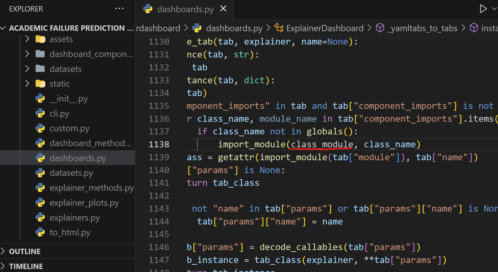

# Democratizing the prediction of student's dropout: The Interactive Visual DashBoard tool

# Requirements
  - Python 3.9 or Python 3.10

# Installation
  1. Download this repository or clone it using `git clone https://github.com/0Kan0/Democratizing-the-prediction-of-student-s-dropout-The-Interactive-Visual-DashBoard-tool.git`.
  2. Install the required packages by running `pip install -r requirements.txt`.
  3. Once the installation has ended, access to where the libraries are installed, access explainerdashboard library folder and open dashboards.py. There you should change this line of code in order for this app     to work:
  

  
  &nbsp; &nbsp; &nbsp; &nbsp;
  
  

# Usage
  4. Access src folder and run `python index.py`. This will open your web browser and redirect to the home screen. If it doesn't, navigate to http://localhost:8080.
  5. Follow the instrunctions provided in the home screen on the file before uploading it.
  6. Upload the file.
  7. Press "Start" buttton.
  8. Wait for the process to finish. You can check it in the terminal (note that depending of the size of the dataset and how good your computer is, the process will take more or less).
  9. If all went correctly, a "Go to dashboard" button should appear below the "Start" button. Click it and that will open a new tab with the dashboard hub (in case it didn't redirect, navigate to                  http://127.0.0.1:8050).
  10. If you want load a new dataset, go to the terminal and end the process with Ctrl+C. Then open it again with `python index.py`.

# Home page

# Dashboard hub

# Acknowledgements
